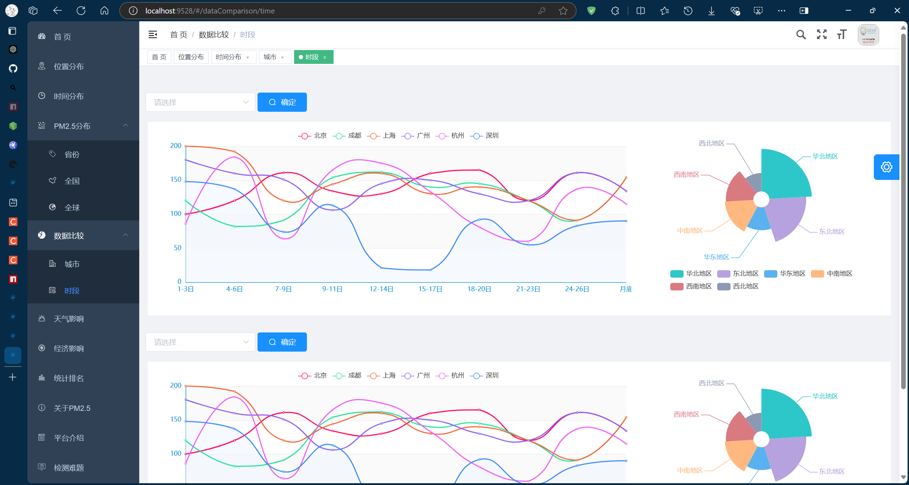

## PM2.5本科玩乐小项目

远古nodejs的项目，主打一个echarts实践，base on [vue-element-admin](https://github.com/PanJiaChen/vue-element-admin)和[element-ui](https://github.com/ElemeFE/element)，非常感谢大佬[@PanJiaChen](https://github.com/PanJiaChen)的优秀项目




## 配置环节

需要注意的版本：

**nodejs**: v14.10.1
**npm**: v6.14.8
**node-sass**: 4.14.1

### 安装

可以换一个proxy，或者换一个镜像，会快一点，npm会根据package.json制作package-lock.json

```
npm install
```

Windows操作系统的注册文件放在 **"C:\Users\Leon\\.npmrc"**

```
registry=https://registry.npmjs.org/
proxy=http://127.0.0.1:7890/
https—proxy=http://127.0.0.1:7890
```

实在不行用yarn，先安装yarn，然后install，yarn会根据package.json制作yarn.lock


```
npm install -g yarn@1.22.15
yarn install
```

yarn的配置文件同样在Windows操作系统的 **"C:\Users\Leon\\.yarnrc"**，也可以加一下代理还有换源，虽然都不一定管用

```
# THIS IS AN AUTOGENERATED FILE. DO NOT EDIT THIS FILE DIRECTLY.
# yarn lockfile v1


registry "https://registry.npm.taobao.org"
#registry "https://registry.yarnpkg.com"
https-proxy "http://127.0.0.1:7890"
lastUpdateCheck 1726926991136
network-timeout "60000"
proxy "http://127.0.0.1:7890"

```

npm或者yarn换代理、换源、查看源、取消设置的命令，如果你想取消设置，可以去上面的注册文件里面删掉对应行，或者运行命令

```
# npm设置
npm config set proxy http://127.0.0.1:7890
npm config set https-proxy http://127.0.0.1:7890
npm config set registry https://registry.npmjs.org
# npm查看
npm config get proxy
npm config get https-proxy
npm config get registry
# npm删除
npm config delete proxy
npm config delete https-proxy
npm config delete registry

# yarn设置
yarn config set proxy http://127.0.0.1:7890
yarn config set https-proxy http://127.0.0.1:7890
yarn config set registry https://registry.yarnpkg.com
# yarn查看
yarn config get proxy
yarn config get https-proxy
yarn config get registry
# yarn删除
yarn config delete proxy
yarn config delete https-proxy
yarn config delete registry
```

### 构建运行

package.json的dev命令改了一下最大内存限制，要不然构建的时候会报错

```
npm run dev
```


## Problem

有可能会遇到一个与 OpenSSL 版本不兼容的问题，通常发生在 Node.js 17 及更高版本中，因为它们默认启用了 OpenSSL 3.0，其中某些算法在 Webpack 或依赖项中不再受支持。

```
Error: error:0308010C:digital envelope routines::unsupported
    at new Hash (node:internal/crypto/hash:69:19)
    at Object.createHash (node:crypto:133:10)
    at module.exports (D:\Code\PMAI\node_modules\webpack\lib\util\createHash.js:90:53)
    at NormalModule._initBuildHash (D:\Code\PMAI\node_modules\webpack\lib\NormalModule.js:401:16)
    at handleParseError (D:\Code\PMAI\node_modules\webpack\lib\NormalModule.js:449:10)
    at D:\Code\PMAI\node_modules\webpack\lib\NormalModule.js:481:5
    at D:\Code\PMAI\node_modules\webpack\lib\NormalModule.js:342:12
    at D:\Code\PMAI\node_modules\loader-runner\lib\LoaderRunner.js:373:3
    at iterateNormalLoaders (D:\Code\PMAI\node_modules\loader-runner\lib\LoaderRunner.js:214:10)
    at Array.<anonymous> (D:\Code\PMAI\node_modules\loader-runner\lib\LoaderRunner.js:205:4)
    at Storage.finished (D:\Code\PMAI\node_modules\enhanced-resolve\lib\CachedInputFileSystem.js:55:16)
    at D:\Code\PMAI\node_modules\enhanced-resolve\lib\CachedInputFileSystem.js:91:9
    at D:\Code\PMAI\node_modules\graceful-fs\graceful-fs.js:123:16
    at FSReqCallback.readFileAfterClose [as oncomplete] (node:internal/fs/read_file_context:68:3) {
  opensslErrorStack: [ 'error:03000086:digital envelope routines::initialization error' ],
  library: 'digital envelope routines',
  reason: 'unsupported',
  code: 'ERR_OSSL_EVP_UNSUPPORTED'
}
```

解决方法之一是将 Node.js 降级到 16.x 或 14.x 版本(我的选择)。如果你不想降级，可以通过以下几种方式临时修复这个问题：

```
set NODE_OPTIONS=--openssl-legacy-provider
```

其他的问题就是无穷无尽的版本问题，项目究极老旧，vue2.6的古董技术，参考意义仅在于关于echarts的实践和使用